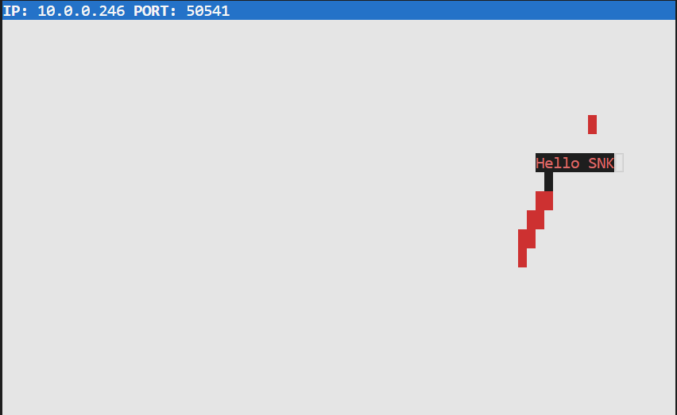

# Snake Client Project

Snake game is a very popular video game. It is a video game concept where the player maneuvers a dot and grows it by ‘eating’ pieces of food. As it moves and eats, it grows and the growing snake becomes an obstacle to smooth maneuvers. The goal is to grow it to become as big as possible without bumping into the side walls, or bumping into itself, upon which it dies.

This is simply a multiplayer take on the genre.

Before you can run this client, you will need to be running the server side which you can download and install from here. 

## Purpose

**This project was made by [Swathi Jayasree](https://github.com/swathij943) and was conducted as part of the [Lighthouse Labs](https://github.com/lighthouse-labs) Web Development Flex Program curriculum.**

## Credits

This game is inspired by the game [Snek](https://store.steampowered.com/app/765590/Coop_SNEK_Online/) created by [Tania Rascia](https://www.taniarascia.com/). The server code for this game was not written from scratch - it is a refashioned version of Rascia's game.

## Final Product

## Getting Started

- Follow steps inside the snek server repo to run the server side https://github.com/lighthouse-labs/snek-multiplayer

## Instructions

- Run the development snake client using the `node play.js` command.
- Use your WASD keys to navigate your snake up, down, left, or right.
- Eat the red dots to grow your snake and gain points. 
- Avoid colliding into the walls or into your own tail, otherwise, it's game over. 
- Press `CTRL` + `C` to quit the game.